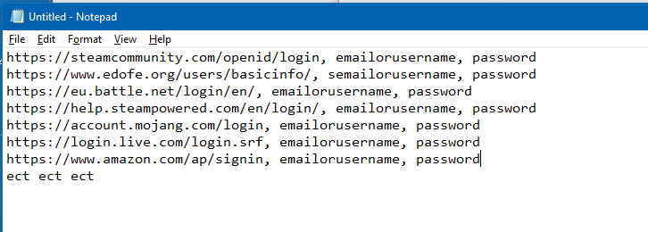

# Python-Key-Logger
A python program that collects typed keys, screenshots and the saved passwords from a computer.
### Disclaimer
This was made for educaltion purposes only
Installing computer monitoring tools on computers you do not own or do not have permission to monitor may violate local, state or federal law.

Logging other people's keystrokes or breaking into other people's computer without their permission can be considered illegal by the courts of many countries. The monitoring software reviewed here is ONLY for authorized system administrators and/or owners of computers. We assume no liability and are not responsible for any misuse or damage caused by the keylogging software. The end user of this software is obliged to obey all applicable local, state, federal and other laws in his country of residence.

## How To Use
1. Download dependancies
2. Change email and password variables
3. Install program on one of your computers and place in start-up folder

## Output
Screen shots

Saved Google Passwords (not real passwords ofc)

Keylogs

## Limitations
1. If uncompiled, dependancies need to be installed on host computer
2. If compiled with pyinstaller then the exe gets flagged as malware
